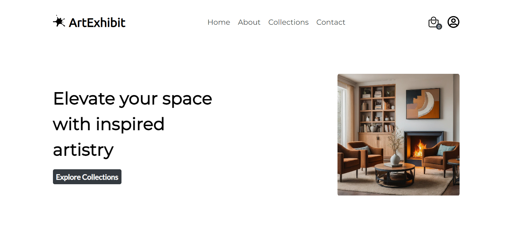

# ArtExhibit

 

## Tech Stack 📚

     
     
     
     
     
     

     
     
     

     
     
     

 

## Demo 🎥

 

<h2 align="center">Setup 🛠</h2>

### Prerequisites :

- `npm` is required for installing dependencies. `npm` usually comes blundled with `node`.

  Install [Node](https://nodejs.org/), if it is not installed already.

  To check whether node is present or not, go to your command line / terminal and type in `node --version` .  
  If a version shows up, means node is installed. If not, install the LTS version of [Node](https://nodejs.org/). Check for [npm](https://www.npmjs.com/get-npm) using `npm --version`.

- install [git](https://git-scm.com/downloads) for version control and for cloning the repository. Verify using `git --version`.
- This app takes weather data from [OpenWeather](https://openweathermap.org/). Which requires an API key. Sign up and generate your own **free** [API](https://openweathermap.org/api) key which will be required during installation process.

### Installation :

Step 1: Fork [this repo](https://github.com/SandeepKrSuman/art-exhibit)

Step 2: Clone your forked version of this repo locally. To clone, go to your command line / terminal, cd over to an appropriate directory and type in `git clone https://github.com/<your username>/art-exhibit.git`

Step 3: `cd art-exhibit`

Step 4: Open the project in your favourite text editor

Step 5: On the command line / terminal type in `npm install` to install dependencies

Step 6: Finally run the app using `npm run dev`

The app will start on port `3000` which can be accessed through <http://localhost:3000> .

 

## Backend 📊

You need to setup backend for proper functioning of the app.

Take a look at [art-exhibit-server](https://github.com/SandeepKrSuman/art-exhibit-server) for more details. This server is developed using NodeJs / ExpressJs with MongoDB.

 
     
## Developer 😎

Made with ❤ by [SandeepKrSuman](https://github.com/SandeepKrSuman).

  

### Asset Credits

- Pictures / Paintings are generated using [Gemini](https://gemini.google.com).
